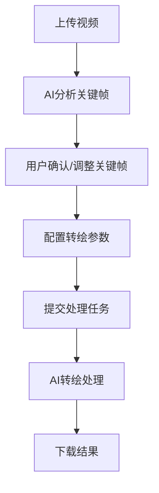

# 功能介绍

绘梦AI是一个专业的AI动漫创作平台，为用户提供从素材处理到成片输出的完整工作流程。平台分为项目后台和创作工作台两大核心模块。

## 项目后台

### 📋 项目管理

完整的项目生命周期管理系统，支持多人协作和版本控制。

**主要功能：**
- 项目创建和配置
- 团队成员管理
- 权限分配控制
- 项目进度跟踪

### 📚 素材拆解

智能解析各类文本素材，自动生成创作脚本和分镜内容。

**支持格式：**
- **小说文本**：自动章节分析，角色关系提取
- **剧本文件**：场景分解，对话提取
- **短剧脚本**：镜头分析，节奏把控

**处理能力：**
- 智能文本分析
- 自动分镜生成
- 角色关系图谱
- 情节节奏分析

### 🎨 基础设定

建立项目的视觉风格和角色体系，确保创作的一致性。

**风格设定：**
- 多种艺术风格模板
- 色彩方案配置
- 画面风格调节
- 自定义风格保存

**人物设定：**
- 角色外观设计
- 表情库管理
- 服装道具设定
- 角色一致性控制

### 🎬 分镜编辑

专业的分镜编辑工具，支持多种素材类型的分镜处理。

**小说/剧本拆解分镜编辑：**
- 自动场景识别
- 智能分镜建议
- 手动调整优化
- 分镜预览功能

**短剧关键帧编辑：**
- 视频关键帧提取
- 帧序列编辑
- 时间轴管理
- 动作连贯性检查

## 创作工作台

### 🎯 分镜编辑

精细化的分镜创作工具，提供专业级的编辑体验。

**关键帧选择：**
- AI智能推荐关键帧
- 类似苹果LivePhoto的交互界面
- 手动精确调整
- 实时预览效果

**参数配置：**
- 转绘强度调节
- 风格参数设置
- 细节控制选项
- 批量参数应用

**批量转绘：**
- 一键批量处理
- 智能队列管理
- 并行处理能力
- 进度实时监控

### ⚡ 批量转绘

高效的批量处理系统，大幅提升创作效率。

**预览功能：**
- 实时效果预览
- 多角度对比
- 质量评估
- 效果调优建议

**重新生成：**
- 一键重新处理
- 参数微调重生成
- 批量重新生成
- 历史版本对比

**更换本地图片：**
- 支持本地图片上传
- 图片格式转换
- 尺寸自动适配
- 批量图片替换

**下载图片：**
- 多格式导出
- 批量下载
- 压缩包打包
- 云端存储同步

### 🔧 自动修复

 AI驱动的智能修复系统，提升画面质量和视觉效果。

**擦除/重绘：**
- 智能区域识别
- 精确擦除工具
- AI自动重绘
- 无缝融合技术

**AI自动润色：**
- 色彩自动调节
- 对比度优化
- 细节增强
- 风格统一化

**配置信息：**
- 修复参数设置
- 质量等级选择
- 处理强度调节
- 自定义修复模板

### 🎥 视频生成

多模型视频生成系统，支持多种生成方式和质量选择。

**模型选择：**
- 多种AI视频生成模型
- 不同风格特色
- 质量等级选择
- 处理速度对比

**提示词润色：**
- AI智能提示词优化
- 关键词提取
- 语义增强
- 效果预测

**提交对口型：**
- 音频同步处理
- 口型匹配算法
- 表情自然化
- 语音情感识别

### 🎤 视频对口型

专业的音视频同步处理系统，实现自然的对口型效果。

**模型切换：**
- 多种对口型模型
- 不同语言支持
- 精度等级选择
- 实时效果预览

**编辑音频：**
- 音频剪辑工具
- 音量调节
- 音效添加
- 背景音乐混合

## 工作流程

## 技术优势

### 🚀 高性能处理
- 基于GPU加速的AI处理
- 优化的算法确保快速响应
- 支持大文件和高分辨率视频

### 🎯 精确控制
- 帧级别的精确控制
- 丰富的参数调节选项
- 实时预览和调整

### 🔒 安全可靠
- 数据加密传输
- 隐私保护机制
- 稳定的服务架构

### 🌐 易于使用
- 直观的用户界面
- 简化的操作流程
- 详细的使用指南

## 应用场景

- **动画制作**：将真实视频转换为动画风格
- **艺术创作**：探索不同的视觉艺术风格
- **内容创作**：为社交媒体制作独特内容
- **教育培训**：制作教学动画材料
- **商业应用**：品牌宣传和营销内容

## 开始使用

准备好开始您的AI动画创作之旅了吗？

[快速开始 →](/getting-started) [用户指南 →](/guide/)