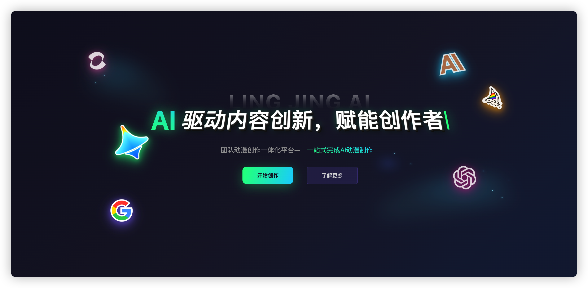
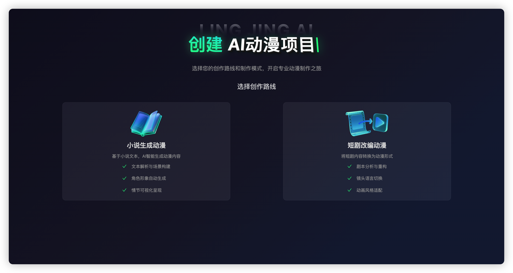

# 快速开始

欢迎使用灵境AI动漫创作平台！本指南将帮助您快速上手我们的AI动漫创作平台。

## ⚙️ 配置推荐

### 系统要求

- **操作系统**：Windows 10/11、macOS 10.15+
- **浏览器**：Chrome（推荐）、Firefox、Safari、Edge
- **网络**：稳定的宽带连接（建议10Mbps以上）

### 设备推荐

- **桌面设备**：获得最佳创作体验
- **显示器**：1920×1080分辨率以上（推荐）
- **输入设备**：鼠标+键盘（支持触控板）

## 🔐 注册/登录流程

### 新用户注册 / 用户登录

1. 访问[灵境AI动漫创作平台官网](https://huimengai.com/)
2. 点击「开始创作」按钮
3. 填写手机号，输入验证码
4. 选择登录团队
5. 点击「立即登录」

::: tip 登录提示

- 当前仅支持手机号验证码登录
- 如首次登录平台，新用户默认创建团队
- 如被其他团队邀请，则可选择其他团队登录
:::

## 📁 创建项目流程

### 1️⃣ 第一步：新建项目

> 如首次注册且未被团队邀请，则从第2步开始

1. 选择「新建项目」
2. 选择创作路线
3. 输入项目信息
4. （可选）上传原始素材（如小说/剧本或短剧等）
5. 进入项目管理页面

### 2️⃣ 第二步：项目初始化

1. 填写项目基本信息：
   - 项目名称
   - 项目描述
   - 选择项目截止日期
   - 邀请团队成员
   - 上传项目原始文件
2. 上传（部分）项目原始文件后，点击「解析文件」
3. 等待文件解析完成，点击「项目设定」标签页

### 3️⃣ 第三步：项目设定

1. 选择动漫风格
2. 配置动漫项目角色
3. 调整小说剧本分镜/短剧关键帧

::: tip 分镜提示

- 管理员/导演可随时调整或编辑分镜相关信息
- 其他成员仅可查看项目信息/项目设定，不可编辑
:::

## 🎬 项目制作流程（短剧转绘）

### 关键帧选择模块

如果是您不希望制作的关键帧：

1. 点击「重选关键帧」
2. 选择期望的关键帧，点击「设为关键帧」
3. （可选）为每个关键帧配置不同的参数
4. 点击「提交转绘」

### 批量出图模块

- 可以在批量图片中选择满意的一张
- （可选）点击「自动修复」，跳转自动修复模块
- 点击「提交视频生成」，跳转视频生成模块
- 鼠标移入图像
  - 点击「预览」查看大图
  - 点击「重新生成」重新生成该动漫关键帧
  - 点击「下载」可以保存该图像到本地

### 自动修复模块

1. 选择「擦除」或「重绘」
2. **重要：需要在右侧图像上选择蒙版工具涂抹需要擦除/重绘的区域**
3. 输入擦除或重绘区域提示词描述
4. （可选）点击「AI一键润色」，自动润色提示词
5. 点击「开始生成」
6. （可选）可以将该图像保存至本地或将该图像替换到左侧批量生图模块暂存

::: tip 修复提示

- 可以将图像替换至左侧批量生图区域暂存对比
:::

### 视频生成模块

1. 选择任意视频生成模型
2. 输入视频生成提示词
3. （可选）点击「AI一键润色」
4. 点击「生成视频」
5. 点击「提交对口型」

::: tip 视频生成提示

- 可以将图像替换至左侧批量生图区域暂存对比
:::

### 视频对口型模块

1. 选择对口型模型
2. 自动截取短剧音频（用户可自主上传、编辑）
3. 点击「对口型」

## 🚀 下一步

- 🎨 探索[功能介绍](/features/)了解详细功能
- ❓ 遇到问题？查看[常见问题](/guide/faq)

::: warning 注意事项

- 请确保上传的视频内容符合平台使用条款
- 处理时间取决于视频长度和复杂度
- 建议在网络稳定的环境下使用
:::
