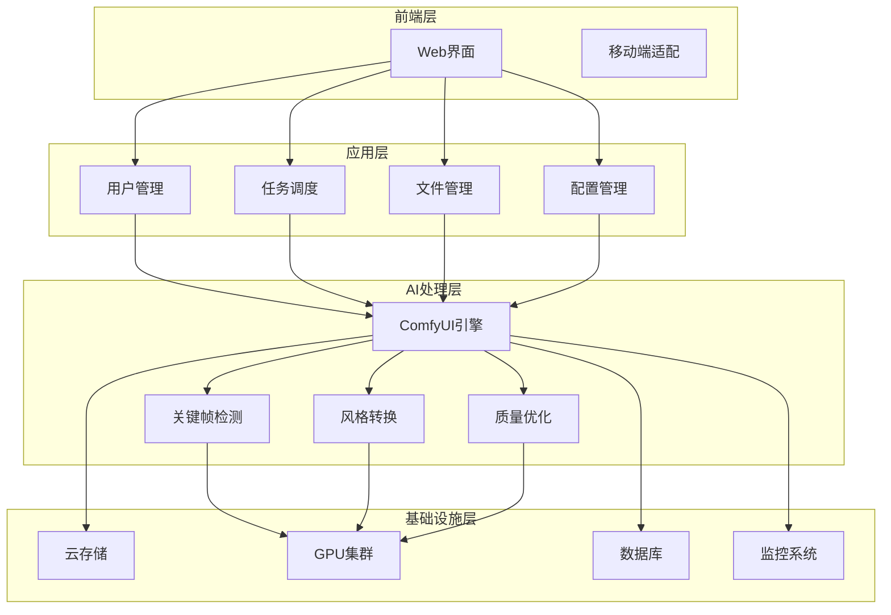

# 平台概述

绘梦AI是一个专业的 AI动漫创作平台，旨在为用户提供简单易用、功能强大的AI动画制作工具。

## 产品定位

### 🎯 核心理念

**让AI动画创作变得简单而专业**

我们相信，优秀的AI工具应该既强大又易用。绘梦AI将复杂的AI技术封装在直观的用户界面中，让每个人都能轻松创作出专业级的AI动画作品。

### 🌟 设计原则

**简洁性**
- 直观的用户界面设计
- 简化的操作流程
- 清晰的功能布局

**专业性**
- 基于ComfyUI的强大AI引擎
- 丰富的参数配置选项
- 高质量的输出效果

**效率性**
- 智能的自动化功能
- 批量处理能力
- 快速的处理速度

**可靠性**
- 稳定的服务架构
- 数据安全保障
- 持续的技术支持

## 系统架构

### 🏗️ 技术架构

### 🔧 核心组件

**前端界面**
- 响应式Web设计
- 支持主流浏览器
- 移动端友好界面

**AI处理引擎**
- 基于ComfyUI框架
- GPU加速处理
- 多模型支持

**任务调度系统**
- 智能队列管理
- 负载均衡
- 故障恢复

**存储系统**
- 分布式文件存储
- 数据备份机制
- 快速访问优化

## 功能模块

### 📁 文件管理模块

**上传功能**
- 支持多种视频格式
- 拖拽上传界面
- 批量上传支持
- 上传进度显示

**文件处理**
- 自动格式转换
- 质量检测
- 元数据提取
- 预览生成

### 🎬 关键帧模块

**自动检测**
- AI算法分析
- 动作变化识别
- 场景转换检测
- 质量评估

**手动调整**
- 类似LivePhoto的交互界面
- 实时预览功能
- 精确帧控制
- 批量操作支持

**状态管理**
- 待处理状态
- 已配置状态
- 处理中状态
- 已完成状态

### ⚙️ 配置模块

**风格设置**
- 多种艺术风格预设
- 自定义风格参数
- 风格强度调节
- 效果预览

**参数配置**
- 转绘强度设置
- 细节保持程度
- 色彩饱和度
- 对比度调节

**高级选项**
- 模型选择
- 采样方法
- 迭代次数
- 随机种子

### 📋 任务管理模块

**任务创建**
- 参数验证
- 资源分配
- 优先级设置
- 预估时间

**进度监控**
- 实时状态更新
- 进度百分比
- 剩余时间估算
- 错误信息显示

**结果管理**
- 文件下载
- 预览功能
- 历史记录
- 分享链接

## 用户角色

### 👤 普通用户

**权限范围**
- 上传和处理个人视频
- 使用基础功能
- 下载处理结果
- 查看个人任务历史

**使用限制**
- 每日处理次数限制
- 文件大小限制
- 存储空间限制
- 基础技术支持

### 👑 高级用户

**额外权限**
- 更高的处理配额
- 高级参数配置
- 批量处理功能
- 优先处理队列

**增值服务**
- 更大存储空间
- 更长保存时间
- 专属技术支持
- 新功能优先体验

### 🏢 企业用户

**专业功能**
- API接口访问
- 自定义模型训练
- 私有部署选项
- 团队协作功能

**服务保障**
- SLA服务协议
- 专属客户经理
- 定制化开发
- 7x24技术支持

## 工作流程

### 📝 标准流程

1. **准备阶段**
   - 用户注册/登录
   - 上传视频文件
   - 系统预处理

2. **配置阶段**
   - AI自动分析关键帧
   - 用户确认或调整关键帧
   - 设置转绘参数

3. **处理阶段**
   - 提交处理任务
   - 系统队列调度
   - AI引擎处理

4. **完成阶段**
   - 处理结果生成
   - 质量检查
   - 用户下载

### 🔄 批量流程

1. **批量上传**
   - 选择多个视频文件
   - 统一参数配置
   - 批量任务创建

2. **并行处理**
   - 智能资源分配
   - 并行任务执行
   - 进度统一监控

3. **结果管理**
   - 批量结果下载
   - 统计报告生成
   - 历史记录保存

## 技术特色

### 🚀 性能优势

**高效处理**
- GPU集群加速
- 智能负载均衡
- 缓存优化策略
- 并行处理架构

**快速响应**
- CDN内容分发
- 就近服务节点
- 预加载机制
- 异步处理模式

### 🎯 质量保证

**AI算法**
- 先进的深度学习模型
- 持续的算法优化
- 多模型融合技术
- 质量评估机制

**输出质量**
- 高分辨率支持
- 细节保持优化
- 色彩还原准确
- 动画流畅性保证

### 🔒 安全保障

**数据安全**
- 端到端加密传输
- 数据隔离存储
- 定期安全备份
- 访问权限控制

**隐私保护**
- 用户数据匿名化
- 自动数据清理
- 隐私政策透明
- 合规性保证

## 发展规划

### 🎯 短期目标（3-6个月）

- 优化处理速度和质量
- 增加更多艺术风格
- 完善移动端体验
- 扩展API功能

### 🚀 中期目标（6-12个月）

- 支持更多视频格式
- 增加实时预览功能
- 开发协作功能
- 推出企业版本

### 🌟 长期愿景（1-2年）

- 构建AI创作生态
- 支持自定义模型
- 开放平台API
- 国际化部署

---

了解了平台概述后，您可以继续学习具体的功能使用方法：

[关键帧模块 →](/guide/keyframe) [转绘配置 →](/guide/config) [任务管理 →](/guide/tasks)